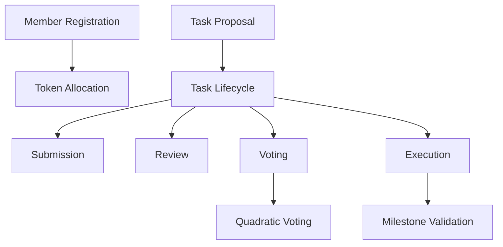

# Simple Assign Suite

A decentralized task management and allocation platform leveraging blockchain technology for transparent, fair, and efficient team collaboration.

## Overview

Simple Assign Suite provides a robust framework for teams to:

- Propose and manage collaborative tasks
- Implement democratic task allocation and voting
- Enable flexible resource distribution
- Maintain transparent task tracking and milestone progression

## Key Features

- Decentralized task management
- Quadratic voting mechanism
- Milestone-based task completion
- Flexible team collaboration model

## Architecture



## Contract Documentation

### assign-governance.clar

Manages all governance and task allocation operations.

#### Key Functions

1. Membership Management
```clarity
(define-public (register-member (token-amount uint) (is-expert bool)))
(define-public (delegate-votes (delegate principal)))
```

2. Task Management
```clarity
(define-public (create-task 
  (title (string-ascii 100))
  (description (string-utf8 1000))
  (funding-amount uint)
  (milestones (list 10 {...}))))
```

3. Voting Mechanisms
```clarity
(define-public (vote-on-task (task-id uint) (vote-for bool)))
(define-public (finalize-task (task-id uint)))
```

## Getting Started

### Prerequisites

- Clarinet
- Stacks wallet
- Allocation tokens

### Quick Start

1. Register as a member:
```clarity
(contract-call? .assign-governance register-member u1000 false)
```

2. Create a task:
```clarity
(contract-call? .assign-governance create-task 
  "Blockchain Documentation Project" 
  "Comprehensive technical documentation" 
  u5000 
  milestones)
```

3. Vote on a task:
```clarity
(contract-call? .assign-governance vote-on-task u1 true)
```

## Development

### Testing

```bash
clarinet test
```

### Local Development

```bash
clarinet console
clarinet deploy
```

## Security Considerations

- Strict access control
- Quadratic voting protection
- Milestone-based task validation
- Transparent governance mechanisms

## Limitations

- Simplified voting calculations
- Basic task management model
- Minimal parameter validation

## License

MIT License